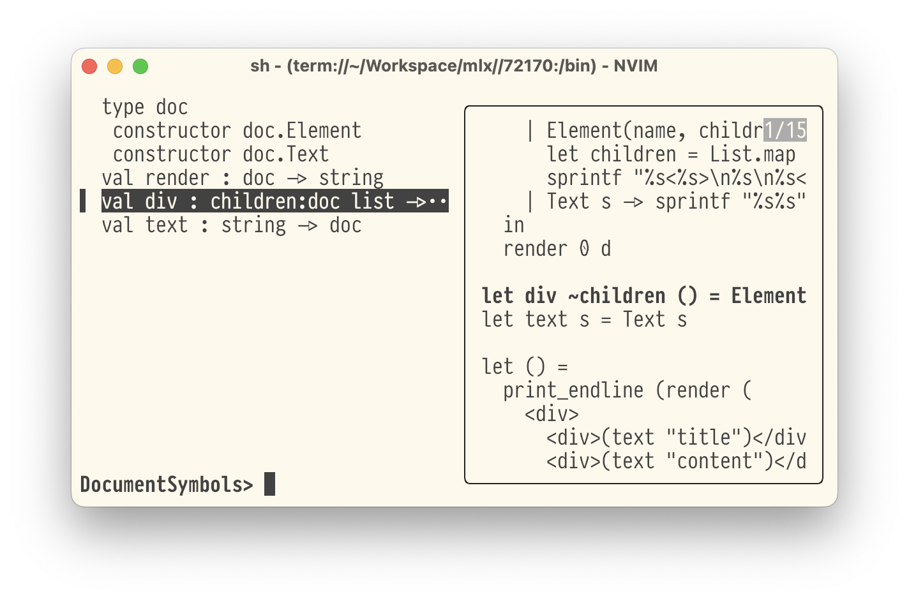
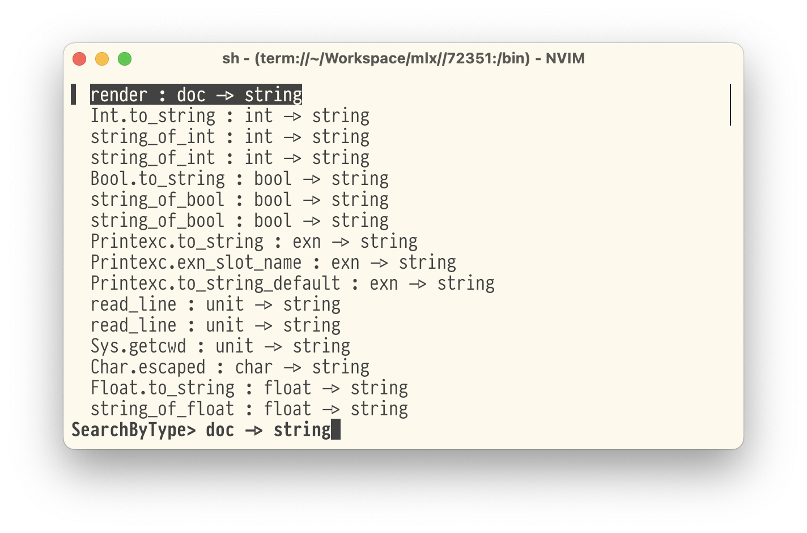

# ocaml.nvim

This is a neovim plugin for OCaml development. It builds on top of neovim's LSP
support and provides methods/handlers for ocamllsp specific features.

## `:OCamlSwitchImplIntf` switch between `.ml` and `.mli`

Simply run `:OCamlSwitchImplIntf` to switch between `.ml` and `.mli` files.

## `:OCamlDocumentSymbols` show all symbols in the current buffer

This is an analogue of LSP's document symbols, but it is formatted nicely for
OCaml and allows easy navigation. It also includes type information.

## `:OCamlSearchByType` seaches values by type

Searches values by type. Uses merlin's `search-by-type` feature.

This feature requires [nvim-fzf][].

[nvim-fzf]: https://github.com/vijaymarupudi/nvim-fzf
